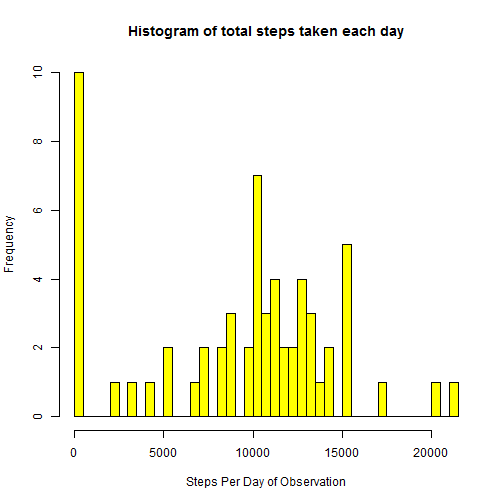
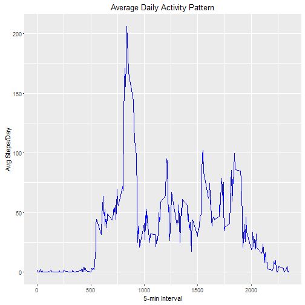
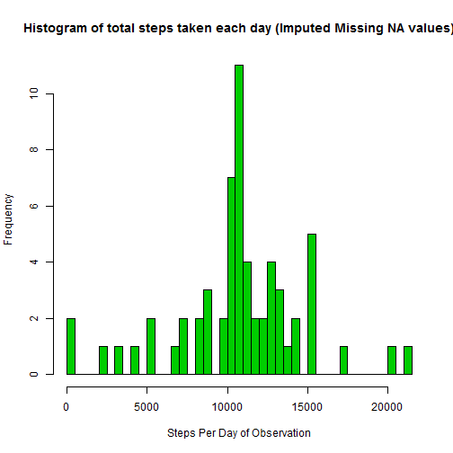

---
<H1><CR> Title: "Reproducible Research Assignment: Course Project 1"  </CR></H1>
<H3><CR> Author: "WeeLeong"     </H3></CR>
<H3><CR> Date: "May 17, 2016"   </H3></CR>
<H3><CR> Output: html_document  </H3></CR>

==================================================================================================================================================================
<H4><b> Step 1: Initialize knitr settings, load all R libraries and set the homedir where the R Mark-down file is stored </b></H4>
In this analysis, homedir is set to <font color="blue"><i>"D:/Users/Koo Wee Leong/My Documents/My Education/Coursera/Data Science - John Hopkins/R-Workspace/Reproducible Research - Course Project 1"</i></font><BR>


<H4><b> Step 2: Loading and preprocessing the data </b></H4>
- Show any code that is needed to
- Load the data (i.e. read.csv())
        - download the file from Coursera Reproducible Research Course Project 1 website
        - extract the data into dataframe 
- Process/transform the data (if necessary) into a format suitable for your analysis


```r
        fileURL = "https://d396qusza40orc.cloudfront.net/repdata%2Fdata%2Factivity.zip" ## Coursera URL of datafile
        temp <- tempfile()
        download.file(fileURL,temp)
        unzip(temp)
        raw_activity_df <- data.table(read.csv("./activity.csv", na.strings = "NA", stringsAsFactors = FALSE))
        raw_activity_df$date <- ymd(raw_activity_df$date)
```
<BR></BR>
<H4><b><u> Question 1: What is mean total number of steps taken per day? </u></b></H4>
- For this part of the assignment, you can ignore the missing values in the dataset.
- Calculate the total number of steps taken per day
- If you do not understand the difference between a histogram and a barplot, research the difference between them. Make a histogram of the total number of steps taken each day
- Calculate and report the mean and median of the total number of steps taken per day


```r
        total_steps_by_days_df <- ddply (raw_activity_df, .(date), summarize, total_steps = sum(steps,na.rm = TRUE))
        number_days = sum(count(total_steps_by_days_df$date)$freq)     ## count #days of observations 
        mean_of_steps_by_day = mean(total_steps_by_days_df$total_steps, na.rm = TRUE)
        median_of_steps_by_day = median(total_steps_by_days_df$total_steps, na.rm = TRUE)
        hist(total_steps_by_days_df$total_steps, breaks =number_days, col = 7, main = "Histogram of total steps taken each day", xlab = "Steps Per Day of Observation")
```


<BR></BR>
<b>Answer:</b> The mean steps per day is <font color="blue"><i> 9354 </i></font> and the median steps per day is <font color="blue"><i> 10395 </i></font>
 
<BR></BR>
<H4><u><b> Question 2: What is the average daily activity pattern? </b></u></H4>
- Make a time series plot (i.e. type = "l") of the 5-minute interval (x-axis) and the average number of steps taken, averaged across all days (y-axis) 
- Which 5-minute interval, on average across all the days in the dataset, contains the maximum number of steps?

```r
        avg_steps_by_interval_df  <- ddply (raw_activity_df, .(interval), summarize,  average_steps = mean(steps,na.rm = TRUE))
        max_interval_of_steps <- avg_steps_by_interval_df[avg_steps_by_interval_df$average_steps== max(avg_steps_by_interval_df$average_steps),"interval"]
        max_avg_of_steps <- avg_steps_by_interval_df[avg_steps_by_interval_df$average_steps== max(avg_steps_by_interval_df$average_steps),"average_steps"]
        ggplot (avg_steps_by_interval_df,  aes(interval, average_steps)) +  geom_line(size=0.7,col="blue") + labs(y="Avg Steps/Day", x="5-min Interval") + ggtitle("Average Daily Activity Pattern")
```


<BR></BR>
<b>Answer:</b> The <font color="blue"><i> 835th </i></font> 5-min interval has the maximum average number of <font color="blue"><i> 206.1698113 </i></font> steps. 
<BR></BR>
<BR></BR>
<H4><b><u> Question 3: Imputing missing values </u></b></H4>
Note that there are a number of days/intervals where there are missing values (coded as NA). The presence of missing days may introduce bias into some calculations or summaries of the data.

- Calculate and report the total number of missing values in the dataset (i.e. the total number of rows with NAs)
- Devise a strategy for filling in all of the missing values in the dataset. The strategy does not need to be sophisticated. For example, you could use the mean/median for that day, or the mean for that 5-minute interval, etc.
- Create a new dataset that is equal to the original dataset but with the missing data filled in.
- Make a histogram of the total number of steps taken each day and Calculate and report the mean and median total number of steps taken per day. Do these values differ from the estimates from the first part of the assignment? What is the impact of imputing missing data on the estimates of the total daily number of steps?

<b>Answer:</b> In this case, a simple strategy would be replacing the NA values with the mean steps for the respective intervals already computed in Question 2. 

```r
        avg_steps_by_interval_dt <- data.table (avg_steps_by_interval_df) ## convert to data.table for easy reference
        imputed_na_activity_df <- raw_activity_df 
        num_na_steps_before_impute <- sum(is.na(imputed_na_activity_df$steps))
        for(i in 1:nrow(imputed_na_activity_df)) {
                ## iterate each row, if steps is NA value, assign with corresponding interval's avg steps
                interval_value <- imputed_na_activity_df$interval[i] ## get the interval in the current row
                avg_value_of_interval <- avg_steps_by_interval_dt[interval==interval_value,average_steps] ## look up ag value of the interval
                if (is.na(imputed_na_activity_df$steps[i] )) { 
                        ## if tge steps is NA, impute with avg value for the interval
                        imputed_na_activity_df$steps[i] <- avg_value_of_interval   
                }
        }
        
        num_na_steps_after_impute <- sum(is.na(imputed_na_activity_df$steps))
        total_steps_by_days_after_impute_df <- ddply (imputed_na_activity_df, .(date), summarize, total_steps = sum(steps))
        mean_of_steps_by_day_after_impute = mean(total_steps_by_days_after_impute_df$total_steps)
        median_of_steps_by_day_after_impute = median(total_steps_by_days_after_impute_df$total_steps)
        hist(total_steps_by_days_after_impute_df$total_steps, breaks =number_days, col = 3, main = "Histogram of total steps taken each day (Imputed Missing NA values)", xlab = "Steps Per Day of Observation")
```


<BR></BR>
<b>Answer:</b> Before Imputing, there are <font color="blue"><i>2304  </i></font> obervations with "NA" (missing) steps values. After Imputing, there are <font color="blue"><i>0   </i></font> observation. 
We can see that imputing the missing values with the average steps for the interval has <i><b> increases the mean and median of the toal daily steps taken </i> </b>( before imputing <font color="red"><i> mean is 9354 </i></font> and <font color="red"><i> median is 10395 </i></font>, after imputing the <font color="blue"><i> mean is 10766 </i></font> and <font color="blue"><i> median is 10766 </i></font>.

<BR></BR>
<H4><b><u> Question 4: Are there differences in activity patterns between weekdays and weekends?</u></b></H4>
- For this part the weekdays() function may be of some help here. Use the dataset with the filled-in missing values for this part.
- Create a new factor variable in the dataset with two levels - "weekday" and "weekend" indicating whether a given date is a weekday or weekend day.
- Make a panel plot containing a time series plot (i.e. type = "l") of the 5-minute interval (x-axis) and the average number of steps taken, averaged across all weekday days or weekend days (y-axis). See the README file in the GitHub repository to see an example of what this plot should look like using simulated data.
 

```r
        imputed_na_activity_df$day_in_week <- weekdays(imputed_na_activity_df$date) ## add a column on imputed data if the Date is "Monday", "Tuesday", "Wednesday" ...
        imputed_na_activity_df$is_weekday <- factor( (imputed_na_activity_df$day_in_week) %in% c("Monday","Tuesday","Wednesday","Thursday","Friday"), levels=c(FALSE, TRUE), labels=c('weekend', 'weekday')) ## new column if the date is a weekday vs weekend

        weekday_df <- imputed_na_activity_df[is_weekday=="weekday"]
        avg_steps_by_weekday_df <- ddply (weekday_df, .(interval), summarize, avg_steps = mean(steps))
        
        weekend_df <- imputed_na_activity_df[is_weekday=="weekend"]
        avg_steps_by_weekend_df <- ddply (weekend_df, .(interval), summarize, avg_steps = mean(steps))
       
        avg_steps_by_weekday_df$is_weekday <- c("weekday")
        #as.factor(avg_steps_by_weekday_df$is_weekday)
        
        avg_steps_by_weekend_df$is_weekday <- c("weekend")
        #as.factor(avg_steps_by_weekend_df$is_weekday)
        
        final_df <- rbind(avg_steps_by_weekday_df,avg_steps_by_weekend_df)
        
        xyplot (avg_steps ~ interval | is_weekday, data = final_df, type = "l", layout = c(1,2), ylab = "Number of Steps")
```


